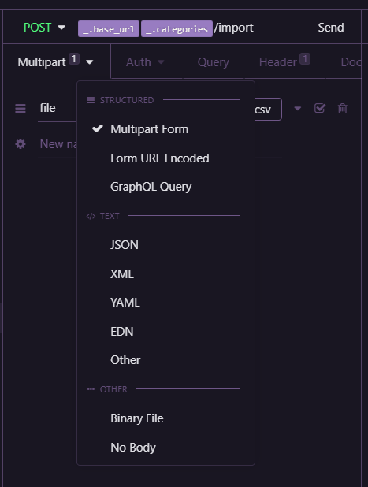
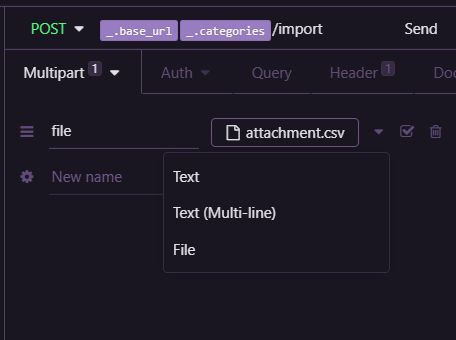
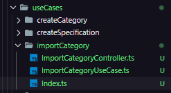

# Upload de arquivos com MULTER e leitura de dados

Aqui estará sendo apresentado o modo de instalação e utilização do multer para upload de arquivos.

Esses passos são apenas realizados assim que todo o projeto já estiver criado e pronto para receber o multer e suas configuração, assim evita-se maiores dificuldades.

## Instalação

Começamos importando-o para o projeto com: 
```SH
yarn add multer 

yarn add @types/multer -D
```
Não utilizaremos como Dependencia de desenvolvimento pois o mesmo será necessario para que os usuarios efetuem o upload durante a utilização real do projeto. No caso apenas as tipagens serão utilizadas no ambiente de desenvolvimento, mas são irrelevantes no ambiente de produção.

## Utilização

No caso esteremos utilizando ele direto em uma rota de Categories [categories.routes.ts](./src/routes/categories.routes.ts).
- Criamos uma pasta para armazenamento temporario na raiz do projeto (tmp)
- Realizamos o import e a configuração básica 
```JS
import multer from 'multer';

const upload = multer({
  dest: './tmp',
});
```
- Aplicamos a constante upload que funcionará como um Middleware na rota
```JS
categoriesRoutes.post('/import', upload.single('file'), (request, response) => {
  const { file } = request;
  console.log(file);
  return response.send();
});
```
Na rota acima foi declarado ` upload.single('file') `, pois passamos o `single` informando que será enviado apenas um arquivo com o nome de `file`, que será reconhecido pelo Insomnia(ambiente de teste utilizado). 

A utilização no Isnomnia é simples, ao passarmos a rota precisamos utilizar o modo Multipart Form para passarmos o arquivo.

- Arquivo utilizado:   [Attachment](./AuxArchive/attachment.csv)





Para que possamos verificar se tudo funcionou, utilizamos o `console.log(file)` para identificar se realmente recebemos o arquivo e caso tudo tenha saido da maneira correta recebemos: 
``` SH
{
  fieldname: 'file',
  originalname: 'attachment.csv',
  encoding: '7bit',
  mimetype: 'text/csv',
  destination: './tmp',
  filename: '3a2709f03aaa3a5fb7066d4bf2285dfc',
  path: 'tmp\\3a2709f03aaa3a5fb7066d4bf2285dfc',
  size: 78
}
```
E o arquivo ja se encontra dentro da pasta que criamos chamada `tmp`.

# Importando dados do arquivo

O arquivo adicionado será lido e utilizado para adicionar dados na nossa base de dados de forma mais eficiente para isso criamos um UseCase de importações:

- Criamos o nosso UseCase para as importações dos dados do arquivo com a mesma estrutura de arquivo dos demais UseCases.
- Lembre-se de alterar sua rota para a utilização de controller.
- Os códigos com as modificação estão listados abaixo.



- [UseCase](./src/modules/cars/useCases/importCategory/ImportCategoryUseCase.ts)

- [Controller](./src/modules/cars/useCases/importCategory/ImportCategoryController.ts)

- [Index](./src/modules/cars/useCases/importCategory/Index.ts)

Para avançarmos na leitura, utilizaremos o conteito de [stream](https://developer.mozilla.org/pt-BR/docs/Web/API/Streams_API/Concepts) com um módulo nativo do Node - [File System](https://nodejs.org/api/fs.html)

- Instalamos a biblioteca: `yarn add csv-parse` e realizamos a importação.
- Utilizamos o csv-parse para realizar a leitura linha por linha do arquivo.
```JS
class ImportCategoryUseCase {
  execute(file: Express.Multer.File): void {
    const stream = fs.createReadStream(file.path);

    const parseFile = csvParse();

    stream.pipe(parseFile);

    parseFile.on('data', async (line) => {
      console.log(line);
    });
  }
}
```

Caso tudo ocorra da maneira certo você terá como resultado:
```SH
[ 'SUV', 'Utilitário esportivo' ]
[ 'Sedan', 'Automóvel de três volumes' ]
[ 'Hatch', 'Carro curto' ]
```
Feito isso, com todos os dados retornando corretamente podemos começar a passar os dados do arquivo para o repositório
 - Criamos um construtor para recuper a instância no UseCase
 ``` JS
constructor(private categoriesRepository: CategoriesRepository) { }
 ```

Feito isso precisamos pegar os dados que estão sendo passados para o `line`
- Criamos uma função chamada loadCategories, onde passaremos os dados para um array realizando a formatação dos dados e assim parassando para nossa base de dados fake.
- Mas caso tentamos apenas passas os dados diretamente com a estrutura atual teriamos o problema que a função não esperaria o fim do processo de leitura do arquivo e provavelmente nos retornaria uma [] vazio. Para contornar isso vamos utilizar uma Promisse como retorno principal ne função.

```JS

/*
array imports = ['name','description']
*/

class ImportCategoryUseCase {
  constructor(private categoriesRepository: CategoriesRepository) { }

  loadCategories(file: Express.Multer.File): Promise<IImportCategory[]> {
    return new Promise((resolve, reject) => {
      const stream = fs.createReadStream(file.path);
      const categories: IImportCategory[] = [];

      const parseFile = csvParse();

      stream.pipe(parseFile);

      parseFile.on('data', async (line) => {
        const [name, description] = line;

        categories.push({
          name,
          description,
        });
      })
        .on('end', () => {
          resolve(categories);
        })
        .on('error', (err) => {
          reject(err);
        });
    });
  }

  async execute(file: Express.Multer.File): Promise<void> {
    const categories = await this.loadCategories(file);
    
        categories.map(async (category) => {
      const { name, description } = category;

      const existsCategory = this.categoriesRepository.findByName(name);

      if (!existsCategory) {
        this.categoriesRepository.create({
          name,
          description,
        });
      }
    });
  }
}
```

Caso tudo tenha sido efetuado corretamente você podera testar no insomnia a importação do arquivo e terá este retorno: 
``` JS
[
  {
    "id": "4df6e0a8-9fa2-4709-b497-9fd956ee9e45",
    "name": "SUV",
    "description": "Utilitário esportivo",
    "created_at": "2021-03-17T19:05:03.397Z"
  },
  {
    "id": "d0e076a8-51b4-4b1d-9292-a52aaeda0121",
    "name": "Sedan",
    "description": "Automóvel de três volumes",
    "created_at": "2021-03-17T19:05:03.397Z"
  },
  {
    "id": "756cbfcc-6060-494a-9a92-a6195a02fc0f",
    "name": "Hatch",
    "description": "Carro curto",
    "created_at": "2021-03-17T19:05:03.397Z"
  }
]
```
